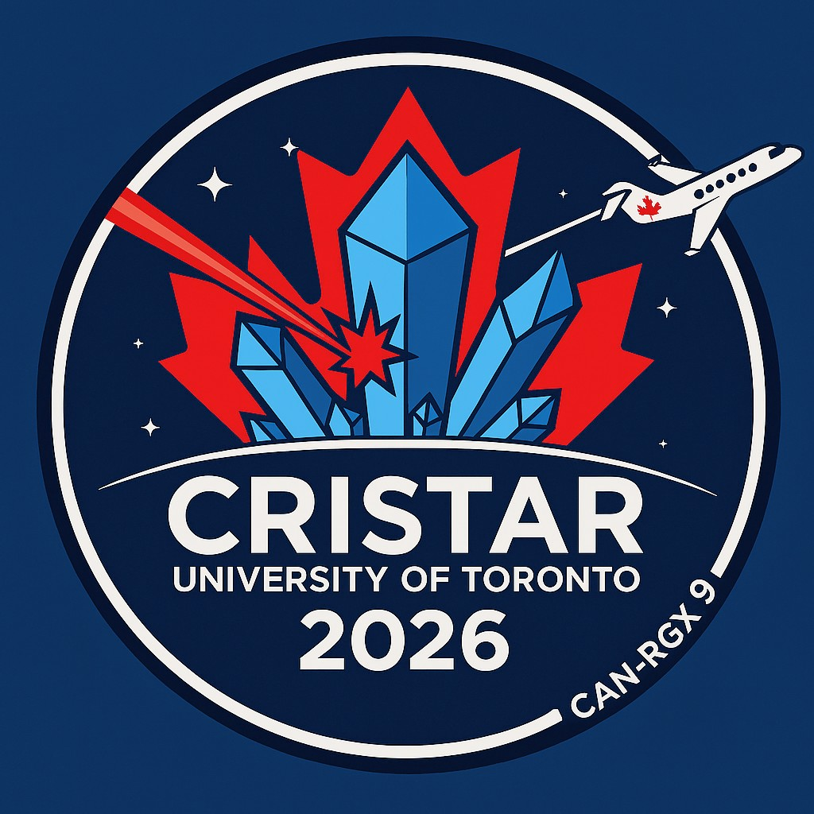
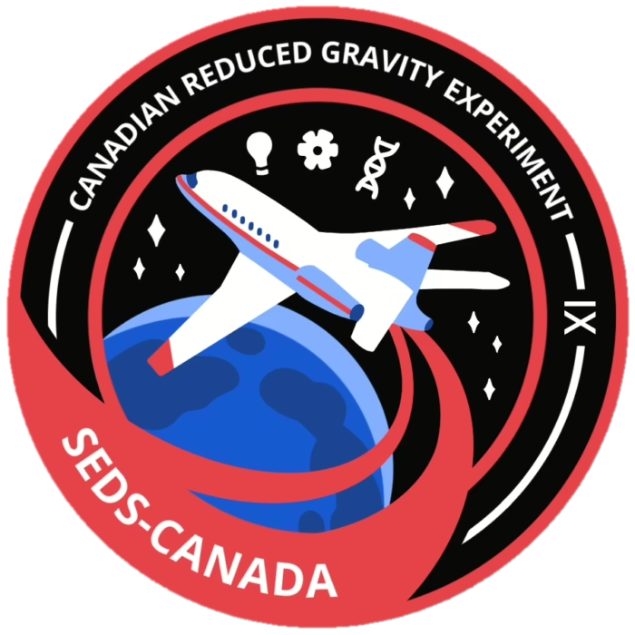

# CRISTAR UofT | CAN-RGX 9

CRISTAR aims to investigate laser-induced crystallization under both microgravity and hypergravity conditions. Our project will use a compact laser cavitation system to generate crystals under different gravity environments. We will then compare the size, structure and purity of the resulting lysozyme crystals to determine how gravity influences morphology and structural characteristics. This work aims to reduce the cost of microgravity-grown crystals by leveraging short-duration suborbital flights. 

#

Team Members:
- Alexander Wainwright
- Khaled Madhoun
- Elias Barsa
- Gabriel Caribe
- Syeda Mahdia
- Lauren Altomare
- Daniel Yu
- Natalie Djuric

[Canadian Reduced Gravity Experiment Design Challenge | 2025-2026 Teams](https://www.seds.ca/can-rgx/#current)

#
 

  </a>
  &nbsp;&nbsp;&nbsp;&nbsp;
  </a>

 

    

 

    

