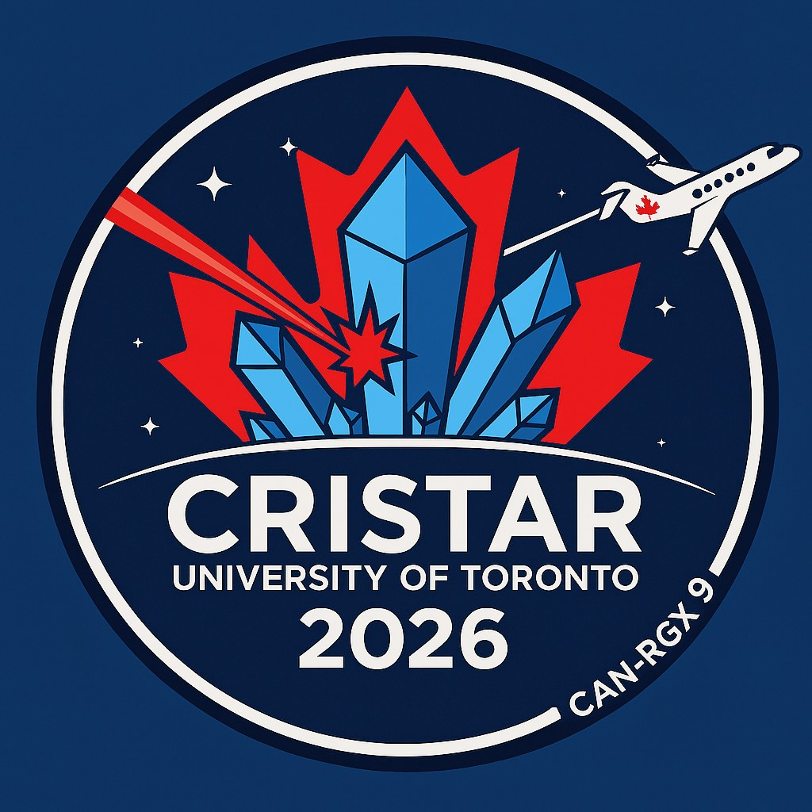

# CRISTAR UofT | CAN-RGX 9

CRISTAR aims to investigate laser-induced crystallization under both microgravity and hypergravity conditions. Our project will use a compact laser cavitation system to generate crystals under different gravity environments. We will then compare the size, structure and purity of the resulting lysozyme crystals to determine how gravity influences morphology and structural characteristics. This work aims to reduce the cost of microgravity-grown crystals by leveraging short-duration suborbital flights. 

#

**Team Members:**
- Alexander Wainwright
- Khaled Madhoun
- Elias Barsa
- Gabriel Caribe
- Syeda Mahdia
- Lauren Altomare
- Daniel Yu
- Natalie Djuric

[Canadian Reduced Gravity Experiment Design Challenge | 2025-2026 Teams](https://www.seds.ca/can-rgx/#current)

#

## Setup and Run

Main GUI entrypoint: `cristar_gui.py`  
Required dependencies: `requirements.txt`

### 1. Local setup

```bash
python3 -m venv .venv
source .venv/bin/activate
pip install --upgrade pip
pip install -r requirements.txt
```

### 2. Run the main GUI

```bash
python3 cristar_gui.py
```

### 3. Testing scripts

The `testing/` folder contains helper/testing scripts.

```bash
python3 testing/sensors.py
python3 testing/test_x11.py
```

### 4. Raspberry Pi quick access

Pi hostname/user: `cristar@cristar.local`  
Alias available on the Pi setup: `gui` (runs the main GUI)

```bash
ssh cristar@cristar.local
gui
```

### 5. Optional remote GUI from a second computer (SSH + Ethernet/Wi-Fi + X11)

If running the GUI remotely from another computer (for example over Ethernet), install XQuartz and launch with X11 forwarding:

```bash
open -a XQuartz; export DISPLAY=:0; ssh -Y -o ForwardX11=yes -o ForwardX11Trusted=yes cristar@cristar.local
```

Then run:

```bash
gui
```

If the `gui` alias is unavailable in a non-interactive shell, run the script directly:

```bash
python3 cristar_gui.py
```

#
<br>

<p align="center">
  </a>
  &nbsp;&nbsp;&nbsp;&nbsp;
  </a>
</p>

<br>

<div align="center">
    <a href="https://www.seds.ca/can-rgx/">
        
    </a>
</div>

<br>

<div align="center">
    <a href="https://www.utoronto.ca/">
        
    </a>
</div>

